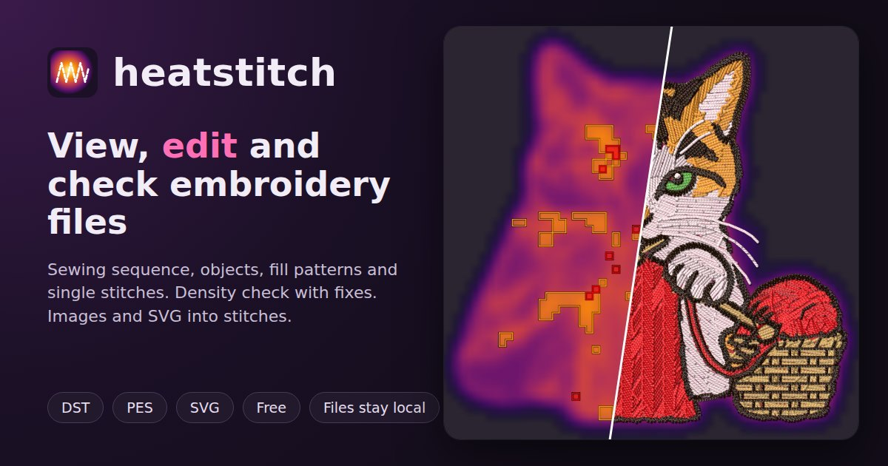
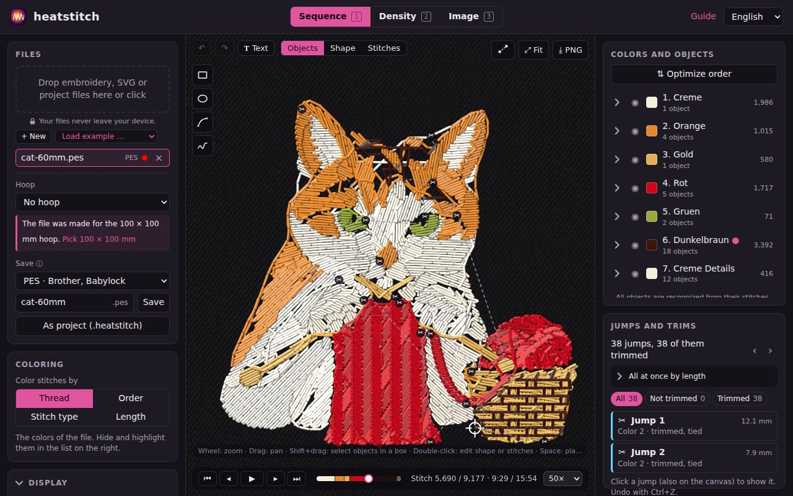
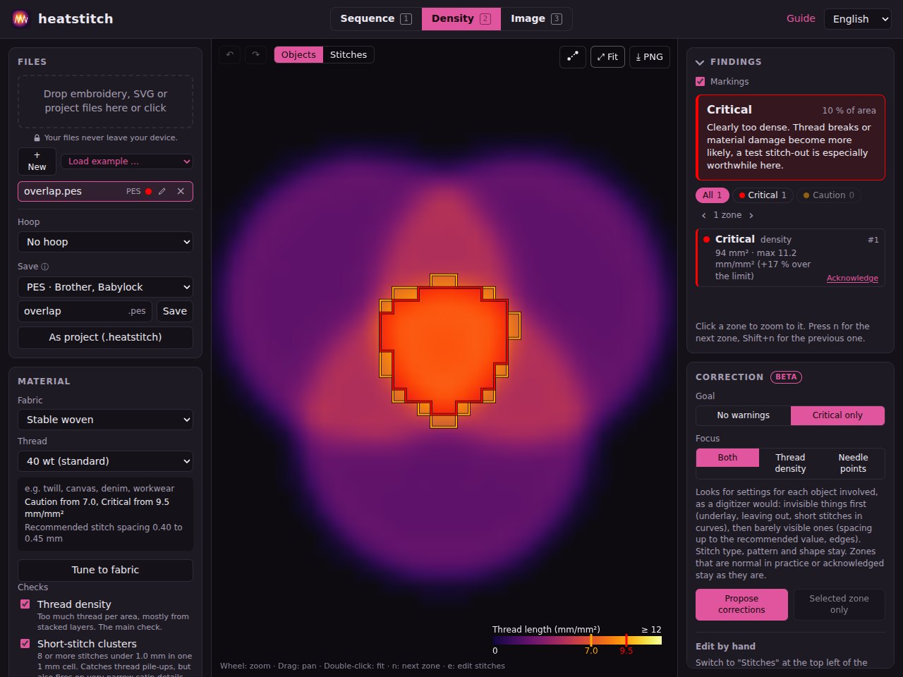
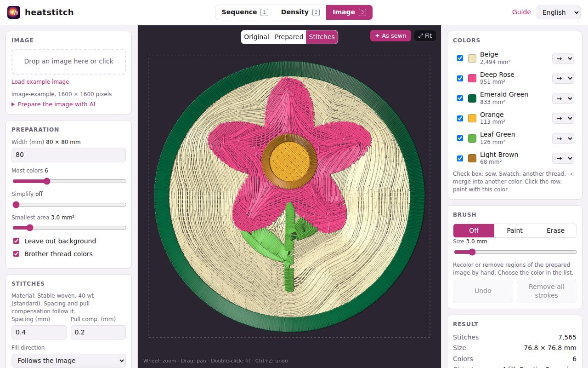
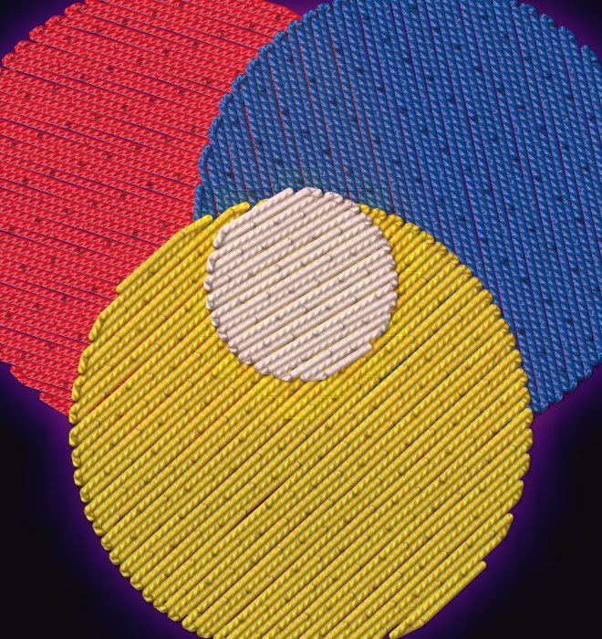
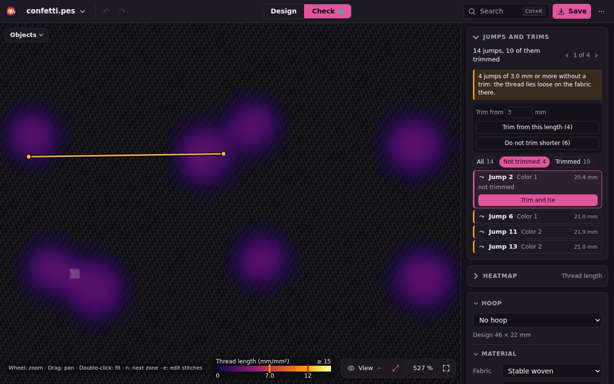
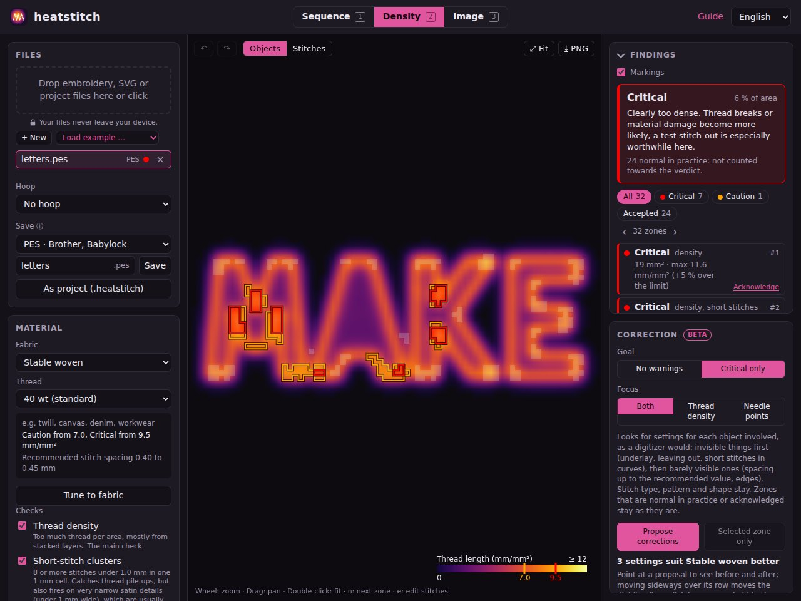
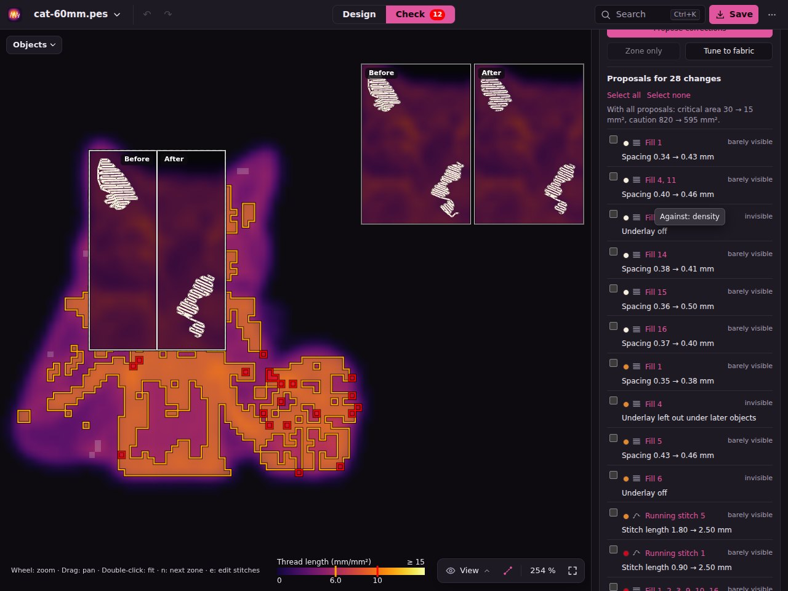
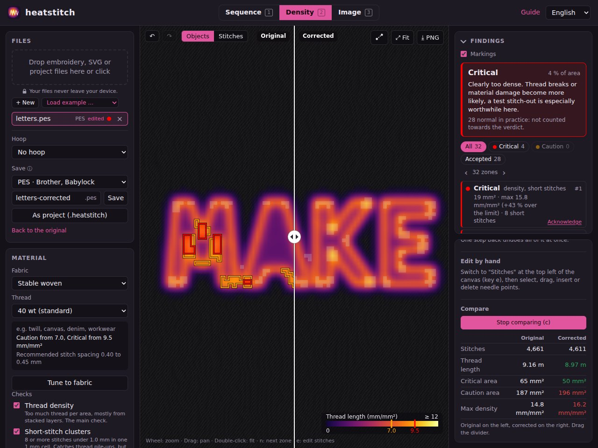

# heatstitch

View, check and fix embroidery files right in the browser, and turn pictures into new ones. No
backend, no uploads: your files never leave your machine.

**Try it: <https://pfedan.github.io/heatstitch/>** (guide: [docs.html](https://pfedan.github.io/heatstitch/docs.html))



## Three modes

Switch at the top of the page, or with the keys `1`, `2` and `3`.

**Sequence** shows how the machine works through the file. Color blocks act as layers (hide,
highlight), stitches can be colored by thread color, order, stitch type or stitch length, markers show
jumps, trims, color changes, start and end and needle penetrations. A player steps through the design
with an estimated sewing time, and the list of jumps lets you trim and tie them one by one or all at
once by length, or leave them untrimmed.



**Density** shows the heatmap, checks the file for the chosen fabric and thread and offers the
correction (all described below).



**Image** turns any picture or photo into an embroidery file: it reduces the colors to thread colors,
lets you fix them with a color list and a brush, and generates fill, satin and running stitches (see
[Image to embroidery](#image-to-embroidery)).



## Privacy

Embroidery files never leave your computer. heatstitch parses, checks, corrects and writes them with
JavaScript in your browser; there is no backend, no account, no analytics and no third-party script.
The site is a set of static files served by GitHub Pages, and the only requests it makes go back to
that same site (the app itself, the example files and the check for a new version). Loaded files and
edits are kept in the browser's IndexedDB so they survive a reload, and removing a file from the list
deletes it there. After the first visit the app also works offline.

The same holds for pictures in Image mode: they are decoded, prepared and converted in the browser
and kept in IndexedDB together with your color edits and brush strokes. The optional *Prepare the
image with AI* workflow only suggests a prompt for an AI chat of your choice; heatstitch itself never
sends the picture anywhere.

## Features

- **Formats:** DST (Tajima) and PES (Brother, reads the PEC block)
- **Two density metrics**, switchable:
  - *Thread length* in mm/mm²: every stitch segment is distributed exactly over the grid cells it crosses
  - *Penetrations* in 1/mm²: needle penetrations per area (perforation risk)
- Grid cell 0.5 to 5 mm, optional Gaussian smoothing
- Absolute color scale with adjustable maximum
- **Validation** of every loaded file (Safe / Caution / Critical) for a chosen material (fabric × thread
  weight), with orange/red overlay, overall verdict and zone list, see below
- Optionally count untrimmed jumps as thread
- Stitch plan overlay in thread colors, jumps dashed
- **Realistic view:** round, twisted threads with shading and shadows, rendered with WebGL, with
  adjustable thread width; the light follows the pointer or the tilt of a phone
- Zoom (wheel, pinch), pan, tooltip with density and position
- Statistics: stitches, jumps, trims, color changes, size, thread length, max density
- Load several files and switch between them (also with arrow keys or j/k, `f` = fit)
- **Examples dropdown** under the file field: the cat, overlapping circles and a confetti design with
  jumps load straight into the app
- **Jump editing** in Sequence mode: trim and tie, or remove trims, one jump at a time or by length
- PNG export of the current view including legend
- **Correction (beta):** automatic, following digitizing practice, and by hand, with undo/redo and an
  original/corrected compare view, see below
- **Save as DST or PES** (own writers, no pyembroidery)
- **Image to embroidery:** PNG, JPG, WebP, SVG; preparation for photos, Brother thread colors, brush,
  tatami fill whose rows follow the image, satin columns and running stitch, without external libraries
- English / German
- PWA: installable, works offline, "Open with" for .dst/.pes and images
- Short guide in English and German (`docs.html`, "Guide" link at the top right)



### Jumps and trims

Sequence mode lists every jump with its length and whether it is trimmed and tied. Long jumps
without a trim are flagged because the thread lies loose on the fabric. *Trim from this length*
and *Do not trim shorter* apply a length rule to all jumps at once; each change is an undo step.



## Validation

Runs automatically once a file is loaded, independent of the display settings. The measurement
(Web Worker) does not depend on the material; the classification does. It is cheap and reruns
instantly for all loaded files when you change fabric or thread.

### Material profiles

The limits apply to 40 wt on stable woven fabric and are scaled by a factor from fabric and thread
(ratio of the recommended stitch spacing to the 0.40 mm reference).

| Fabric | Factor | Recommended spacing (40 wt) |
|---|---|---|
| Stable woven (twill, canvas, denim) | 1.0 | 0.40 to 0.45 mm |
| Cap, structured | 0.9 | 0.40 to 0.50 mm |
| Knit, fleece (piqué, jersey) | 0.85 | 0.42 to 0.50 mm |
| Terry, pile | 0.65 | 0.55 to 0.70 mm |
| Light, delicate (silk, batiste) | 0.6 | 0.60 to 0.70 mm |
| Leather, faux leather (+ perforation check) | 0.7 | 0.50 to 0.80 mm |

| Thread | 60 wt | 40 wt | 30 wt | 12 wt |
|---|---|---|---|---|
| Factor (after the Madeira spacing table) | 1.15 | 1.0 | 0.8 | 0.5 |

### Rules

| Rule | Caution | Critical |
|---|---|---|
| Thread length per area, fill | from 7.0 mm/mm² (about 3 layers) | from 9.5 mm/mm² (4 layers) |
| Thread length per area, pure satin | from 11 mm/mm² | from 12 mm/mm² |
| Short-stitch cluster | ≥ 8 stitches under 1 mm in one cell (woven, caps) | ≥ 8 (all other fabrics) |
| Perforation (leather only) | ≥ 6 penetrations within 1 mm | ≥ 9 |

Density values are multiplied by the profile factor. One fill layer at 0.4 mm spacing has 2.5 mm/mm²,
a satin at 0.4 mm spacing (between penetrations on the same side) 5.0 mm/mm².

- **Grid:** fixed 1 mm cells. Density is computed on 0.2 mm subcells and smoothed with σ = 0.6 mm;
  each cell gets the **peak** of its subcells. That way narrow columns (lettering, borders) are not
  averaged away with their empty surroundings; even fills read at most about 7 % above their nominal
  value.
- **Thresholds sit between typical builds**, so the grid position does not decide: two fills with
  underlay reach up to 6.4, three layers from 7.4, four layers from 9.95, a satin border over a fill
  (both with underlay) up to 9.0.
- **Satin** lies on top and only penetrates at the edges. A cell's limits are interpolated linearly
  between fill and satin values by its satin share (satin = zigzag stitches 1 to 12.1 mm, nearly
  opposite in direction).
- **Short-stitch cluster:** up to 6 short stitches right after a block starts (tie-in after a jump,
  trim, color change or design start) or right before it ends do not count. Longer chains of short
  stitches count from the seventh stitch.
- **Perforation:** for each penetration, the number of other penetrations within 1 mm (tie stitches
  excluded). A row of holes with spacing p gives 2 × ⌊1/p⌋: 4 at 0.35 to 0.5 mm, 6 at 0.33 mm, 10 at
  0.2 mm. Stacked edges and tight inner curves add up.
- **Zones:** connected (8-neighborhood) flagged cells form a zone; its level is that of its worst
  cell. Click (or `n` / Shift+`n`) zooms to it, hovering outlines it, `v` toggles the markings. For
  critical density zones the list shows how many percent the peak is over the limit, so close calls
  are visible.
- **Normal in practice** (`src/validation/practice.ts`): these findings stay in the list but do not
  count towards the verdict, and the correction leaves them alone. Perforation always counts.
  - *Small spot:* Caution up to 3 mm² or a single critical cell (satin ends, object joins, turning
    points, tie-off knots).
  - *Satin join:* mostly satin, compact (at most 16 mm², aspect ratio up to 2.5) and at most 30 %
    over the limit, i.e. two satin layers where columns meet or cross. Two columns stacked
    lengthwise give a long zone and remain a finding.
  - *Short stitches on stable fabric:* pure short-stitch zones on woven fabric and caps.

  *Check anyway* counts such a zone again; *Acknowledge* takes any other zone out of the verdict.
  Both are saved with the file and expire when the zone disappears or grows noticeably after an edit.
- **Tooltip:** shows the cell's check value and the limits that apply to it next to the displayed value.
- API: `measurePattern(pattern)` (profile independent) and `classify(measurement, profile)` in
  `src/validation/validate.ts`. Thresholds in `src/validation/thresholds.ts`, profiles in
  `src/validation/profiles.ts`.



## Correction (beta)

The *Correction* panel sits in the right column below the findings and works with the chosen
material and the enabled checks. It is marked beta: check the result in the compare view and do a
test stitch-out before production. Every change is an undo step (Ctrl+Z / Ctrl+Shift+Z), *Original*
restores the loaded file.

The edited version is stored in the browser next to the unchanged original (IndexedDB) on every
change and restored after a page reload; one undo step then leads back to the original. The original
itself is never overwritten, and *×* removes both.

### Automatic

The correction works like a digitizer by hand: it only changes stitches where it won't show in the
finished embroidery, and leaves spots alone that are normal in practice. The *goal* is either
"no warnings" (fix Caution and Critical) or "critical only" (default). *Selected zone only* limits it
to the zone selected in the list. It runs in a Web Worker, and each step is only kept if the result
in that area does not get worse.

*Focus* sets which rule saves stitches:

- **Both** (default): thread density, short-stitch clusters and, on leather, perforation.
- **Thread density**: only too much thread per area. Covered fill rows are thinned out.
- **Penetrations**: only needle penetrations (short stitches, perforation); in addition,
  penetrations from different layers landing in the same hole are moved apart by at most 0.3 mm.

The steps, in this order:

1. **Clean up** (`src/correct/shorts.ts`): stitches without movement are dropped, chains of tiny
   stitches are merged as long as no point moves more than 0.3 mm.
2. **Pull fills back under borders** (`src/correct/pullback.ts`): if a fill reaches far under a
   satin border stitched later, the row end is pulled back to the usual overlap of about 30 % of the
   border width (0.6 mm under a fill). The border covers the row end anyway; the double layer at the
   edge is saved.
3. **Short stitches in satin curves** (`src/correct/satinShort.ts`): on the inside of tight curves
   the penetrations crowd together. As in digitizing software, every other stitch ends a quarter of
   the column width before the edge; the outline stays closed.
4. **Thin out covered rows** (thread density only, `src/correct/thin.ts`): fill rows lying entirely
   under at least one full later layer are removed in pairs. They are not visible, so no stripes
   appear.
5. **Respace evenly** (`src/correct/respace.ts`): if a fill or satin is still too dense, the whole
   run is rebuilt with evenly wider row or stitch spacing instead of removing single rows. Outline,
   stitch offset and direction stay, and the spacing never exceeds the one recommended for the
   material (woven, 40 wt: 0.45 mm). Narrow details and already uneven runs stay unchanged.
6. **Separate penetrations** (`src/correct/nudge.ts`): with focus on penetrations and for
   perforation on leather; only penetrations between two long enough stitches are moved.

Tie stitches, jumps, trims and color changes stay unchanged.

**What is left alone:** zones that are normal in practice or acknowledged (see Validation) are not
touched; the correction only makes sure they don't get worse. Whatever remains afterwards is reported
by the panel as "check by hand": usually several stacked layers, i.e. a design decision.



### By hand

*Edit stitches* (`e`) shows the stitch plan and, from about 6 px/mm zoom, the penetrations.

- Click selects a penetration, Shift+click extends, Shift+drag selects a rectangle, Ctrl+A selects
  all. Clicking empty space clears the selection, dragging in empty space pans the view.
- Drag selected penetrations or move them with the arrow keys (0.1 mm, with Shift 0.5 mm).
- Delete / Backspace removes them; the neighbors are joined by one stitch.
- *Thin out* removes 25, 33 or 50 % of the cycles in fills and zigzags that lie mostly inside the
  selection.

### Compare

*Compare with original* (`c`, once the file has been changed) splits the view: the original on the
left, the current version on the right, each with its own heatmap, markings and stitch plan. The
divider can be dragged, zoom and pan apply to both sides, and the tooltip shows the values of the
side under the pointer. Below, stitches, thread length, critical and caution area and max density of
both versions are shown side by side.



### Saving

*As DST* / *As PES* writes the current pattern (`src/writers/`). After a change the file is called
`name-corrected.dst`. Only stitches and colors are saved: PE-Design objects and hoop settings of the
original are lost.

- **DST:** a trim is written as a sequence of 3 jumps, but only if the following jump sequence is not
  already long enough. That way trims don't grow on repeated saves (unlike pyembroidery). Untrimmed
  jump sequences that would otherwise read as a trim are merged. Long stitches are split into jumps
  plus one stitch (no extra penetrations). Jumps over 36 mm need 3 or more records and read back as a
  trim; that is a property of the format. DST has no colors.
- **PES:** version 1 with a CEmbOne/CSewSeg object for design software and a PEC block with preview
  images for machines. Only jumps after a trim carry the trim flag (pyembroidery flags every jump).
  Colors keep their PEC palette slot; colors from DST get the nearest one.
- The tests (`tests/writers.test.ts`) check read → write → read for DST, PES and both conversions for
  record equality. The written files were also read back with pyembroidery 1.5.1.

## Image to embroidery

Image mode (key `3`) turns a picture into an embroidery file in two steps, both in a Web Worker
(`src/digitize/worker.ts`). Every change starts a new run; whatever changes during a run is computed
afterwards with the latest settings. The picture, color edits and brush strokes stay in the browser
(IndexedDB, `src/storage/imageStore.ts`). The canvas shows the *Original*, the *Prepared* image or the
*Stitches*.

The methods were chosen after research into papers, vendor manuals and the source of open-source
digitizers. Ink/Stitch and PEmbroider are GPL; only their methods were re-implemented, no code was
copied.

### Preparation (`src/image/`)

1. **Working resolution:** 0.1 mm per pixel (coarser for designs over 120 mm, at most about 1200
   pixels), area averaging when shrinking, transparency kept.
2. **Simplify** (photos only, detected on load: if the 16 most frequent colors cover less than 85 %
   of the pixels, it is a photo): bilateral filter in CIELAB (Tomasi & Manduchi 1998), separated into
   rows and columns and iterated as in Winnemöller et al. 2006. Areas become flat, edges stay.
3. **Color reduction:** weighted k-means on a Lab histogram, which does best at small color counts
   (Celebi, *Improving the performance of k-means for color quantization*, 2011) and keeps small,
   distinct areas such as eyes, where median cut and Wu lose them. A pixel weighs more the more it
   stands out from its surroundings and the more saturated it is. Nearly equal colors (CIEDE2000 under
   6) are merged, tiny inconspicuous ones (under 0.4 % of the area and no further than 22 from any
   other color) are dropped.
4. **Thread colors:** the nearest thread of the Brother palette by CIEDE2000 (Sharma, Wu & Dalal 2005,
   tested against their reference data); colors that land on the same thread become one. The color
   list shows ≠ when no thread is close (ΔE over 10).
5. **Edits by hand:** per color another thread, merge into another color, or leave out; brush strokes
   (paint, erase) are applied before and after the clean-up, so they hold.
6. **Clean-up:** 3×3 majority filter; anti-aliasing seams (at most 0.5 mm wide, color between the two
   neighbors) go to the neighbors; the background (the color of at least 60 % of the border and three
   corners) is dropped where it is connected to the border; areas under *Smallest area* merge into the
   neighbor with the longest shared border (as in Goldman's patent US 6,836,695 and in Wilcom).

### Stitches (`src/digitize/`)

Every connected area becomes one object. Instead of tracing outlines, everything works on a signed
distance field per area (exact distance transform after Felzenszwalb & Huttenlocher 2012, slightly
smoothed). Its zero line lies halfway between pixels, so neighboring areas share the same border:
fill rows end there, satin edges are found there, underlay lies on a contour inside.

- **Kind:** the skeleton (thinning in order of distance, side branches shorter than 1.5 radii pruned)
  gives the widths. Under 1 mm (terry 1.5 mm): running stitch. Up to *Satin up to width* (7 mm), even
  in width (widest point within three standard deviations, as in Goldman's patent), long compared to
  its width and with few branches: satin. Otherwise fill. Generated satin is measured: if it reaches
  more than 2.4 times its nominal density anywhere (tight curves fan out) or leaves more than 5 % of
  the area bare (columns radiating from a center), the area is filled instead.
- **Fill (tatami):** rows on a lattice aligned to the design's origin, penetrations offset by a quarter
  of the stitch length (4 mm) as in Ink/Stitch, so neighboring areas join seamlessly. The rows are
  split into sections that can be sewn back and forth in one go (boustrophedon decomposition, Choset
  2000). Without a fixed angle, each area takes the one of 16 angles with the fewest sections
  (Goldman's patent), preferably 30° apart from touching areas. Underlay: rows turned by 90°, three
  times the spacing, 0.4 mm inside the edge. Between sections the thread travels the shortest way
  inside, under rows not sewn yet (like Ink/Stitch's underpath); where it would lie on sewn rows for
  more than 2 mm, it jumps instead.
- **Fill rows follow the image** (default; `src/digitize/flow.ts`, `src/image/orientation.ts`): a
  direction field from the structure tensor of the original picture (Förstner & Gülch 1987, Bigün &
  Granlund 1987; as in coherence-enhancing abstraction, Weickert 1999, and Coherent Line Drawing, Kang
  et al. 2007), weighted by coherence, i.e. how clear the direction is: fur, hair and strokes set the
  direction. An area's own outline does not count (only from 1.2 mm inside). In flat areas the
  centerline sets the direction if the shape is elongated (fully from three widths of length). If the
  direction is nearly uniform in an area, the rows are laid straight in exactly that direction;
  otherwise they curve as evenly spaced streamlines of the field (Jobard & Lefer 1997): each row
  follows the field, new rows start one spacing beside existing ones, a row ends where it comes closer
  than half a spacing to another. Rows are joined back and forth, gaps between groups are bridged as
  in the straight fill. Before sewing, the rows are measured; where they crowd (over 2.2 times the
  nominal density) or leave gaps, the straight fill is used. Research found no embroidery program that
  derives the stitch direction from the picture's own structure (some align fills to a shape's long
  axis); the research prototype of Liu et al. (Eurographics 2023) needs directions given by hand.
  *Fill direction* swaps it for straight rows or a fixed angle.
- **Satin:** the edges are measured from the centerline at right angles to the border (the "stroke
  normals" of Goldman's patent). 0.4 mm between penetrations on the same side, measured on the side
  that advances more; on the inside of curves every penetration that comes too close (under 0.25 mm)
  moves 15 % of the width inwards. Pull compensation by fabric (woven 0.2 mm, knit 0.35, terry 0.4 per
  side), stitches over 7 mm are split. A network of columns is sewn in one go: each branch out as
  underlay (center walk, zigzag from 4 mm width) and back as satin, like Ink/Stitch's auto-satin. At
  junctions the first column covers, the others reach 0.3 mm into it.
- **Order:** colors by area, the largest first; within a color fills before satin and lines, each time
  the nearest object. Objects sewn earlier reach 0.2 mm under later neighbors. Up to 1 mm apart a
  stitch, up to 3 mm a jump, beyond that a tie-off (0, 0.5, 1, 0.5, 0 mm along the thread), trim, jump
  and tie-in; the same at color changes.
- **Defaults** by material (`digitizeDefaults`): spacing from the profile's recommendation (woven
  40 wt: 0.40 mm between neighboring rows, as measured in the example cat), pull compensation by
  fabric (Wilcom table). Everything can be overridden in the *Stitches* panel.

The generated stitches go through the same check as loaded files. *Take over as embroidery file* adds
them to the file list as a PES file, where they can be corrected and saved as DST or PES. For
comparison on woven fabric with 40 wt:

| Design | Stitches | Caution zones | Critical zones | Trims |
|---|---|---|---|---|
| Cat photo (80 × 107 mm, 5 colors), rows follow the image (18 of 32 fills curved) | 17,800 | 10 | 3 | 157 |
| Same photo, straight rows | 16,400 | 16 | 3 | 131 |
| Example cat (professionally digitized) | 9,200 | 15 | 2 | 89 |

The findings mostly sit where satin overlaps the edge of a fill; the correction in Density mode can
take them on afterwards.

### Prepare the image with AI

heatstitch has no AI built in. Below the image box, *Prepare the image with AI* suggests a workflow
instead: upload the picture to your own AI chat that can edit images, paste a ready-made prompt, load
the result here. The prompt follows the width and color count under *Preparation*: a flat graphic with
at most that many colors, no gradients or textures, nothing narrower than 1 mm in the embroidery (as a
share of the picture's width), white background. A note says that the picture goes to the AI's
provider when you do this.

### Living thread

In the realistic thread view the light follows the pointer or the tilt of a phone
(`src/render/light.ts`; on iPhones after a one-time permission). Thread shines across its fibers, so
satin columns and fill rows light up or darken by their stitch direction, like turning an embroidered
patch in your hand, and the shadows move along. On the first converted picture, Image mode switches to
the realistic view and sweeps the light once around the design; every new picture does it again
(not with the system setting to reduce motion). *✦ As sewn* on the canvas shows it at any time. Research into Wilcom,
Hatch, PE-Design, Embird, Ink/Stitch, mySewnet and online converters found only fixed light settings in
dialogs. *Light follows pointer and tilt* under *Display* switches it off in all modes.

**Limits:** photos are sewn as flat areas (posterized), not shaded with variable density as in
photo-stitch methods. Wide shapes with narrow arms are filled as a whole instead of being split into
fill and satin. The color list only offers the Brother palette.

## Development

```sh
npm install
npm run dev       # dev server
npm test          # unit tests (Vitest)
npm run build     # typecheck + production build into dist/
npm run preview   # view the build locally: http://localhost:4173/heatstitch/
```

The tests generate their DST/PES fixtures synthetically (`tests/helpers/encode.ts`) and check, among
other things, that the grid sums exactly to the total thread length or stitch count.

## Example files

`public/examples/` holds real embroidery files to try out, e.g. `cat-60mm.pes` (cat, 60 mm, PES v6).
The *Load example* dropdown under the file field loads the cat, the overlapping circles and the
confetti design straight into the app. `image-example.svg` is the example picture of Image mode
(fills, satin widths, fine lines), loaded by *Load example image* in that mode.

`public/examples/demos/` holds small synthetic demos for the guide, each with one finding:
`overlap.pes` (stacked fills), `letters.pes` (fill under satin), `sun.dst` (short stitches on knit),
`leather-patch.dst` (perforation on leather) and `confetti.pes` (long jumps without trims, short ones
with trims). They are built with the app's own writers from `tests/helpers/demos.ts`;
`tests/demos.test.ts` checks that they are up to date and show the described finding. After changing
designs or writers: `UPDATE_DEMOS=1 npm test`. The guide images live in `public/guide/` and are not
precached.

## Deployment

`.github/workflows/deploy.yml` tests and builds every push. The site is served from the `gh-pages`
branch: pushes to `main` go to its root at <https://pfedan.github.io/heatstitch/>, and every pull
request gets a preview under `pr-preview/pr-N/` (linked in a PR comment) that is removed again when
the PR closes. Previews only run for branches in this repository, not for forks. One-time setup:
*Settings → Pages → Source: Deploy from a branch*, `gh-pages`, `/ (root)`.

## Format notes

- **DST** has no explicit trim. As in pyembroidery, a sequence of at least 3 jumps counts as a trim
  (`DST_TRIM_JUMP_COUNT` in `src/parsers/dst.ts`). DST also has no thread colors; color blocks get
  substitute colors.
- **PES:** colors come from the PEC palette. The RGB thread lists of newer PES versions are not read
  yet.
- The validation thresholds are derived from digitizing guidelines and calibrated on synthetic
  builds; a comparison with real test stitch-outs is still pending.

## Structure

```
src/parsers/     DST and PES parsers, PEC palette
src/model/       Pattern data model, thread segments, statistics, edit functions,
                 sequence (color blocks, stitch types, jumps, markers), trimming/untrimming jumps
src/density/     Density grid, Gaussian blur, Web Worker
src/validation/  Measurement, profiles, levels, satin detection, short-stitch and perforation rules, zones
src/correct/     Automatic correction: pullback under borders, satin short stitches, respacing,
                 thinning, separating penetrations
src/writers/     DST and PES writers (PEC block, preview images)
src/image/       Image preparation: color spaces, CIEDE2000, filters, color reduction, distance
                 transform, orientation, clean-up
src/digitize/    Stitches from images: distance fields, skeleton, fill, flow fill, satin, running
                 stitch, sequencing, Web Worker
src/render/      Viewport, color scale, heatmap, stitch plan, realistic threads (WebGL), light,
                 legend, sequence rendering (coloring, markers, needle)
src/ui/          File list, validation, correction panel, stitch editor, controls, statistics,
                 tooltip, export, color list, jump list, player, Image mode, thread picker
src/i18n/        Translations EN/DE
public/examples/ Example embroidery files (loadable from the dropdown)
public/guide/    Screenshots for the guide
docs.html        Short guide EN/DE (src/docs.ts, src/docs.css)
public/og-image.jpg, robots.txt, sitemap.xml  Social media preview image, crawlers
```

## Contributing

Bug reports, example files and pull requests are welcome. See [CONTRIBUTING.md](CONTRIBUTING.md) for
setup, tests, pull request previews and the English/German conventions.

## License

[MIT](LICENSE) © Daniel Pfeffer
