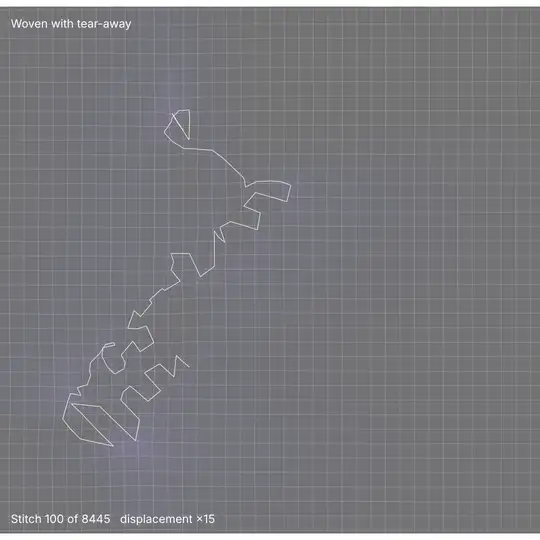
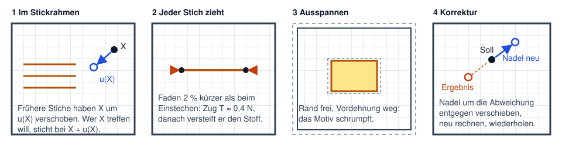
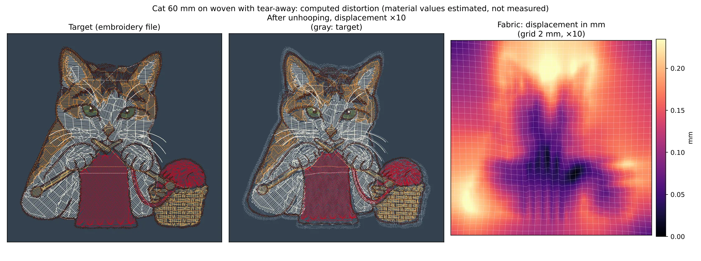
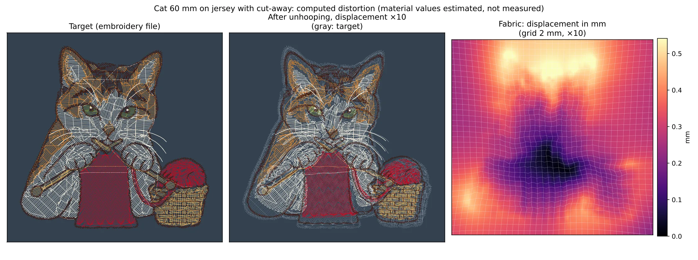
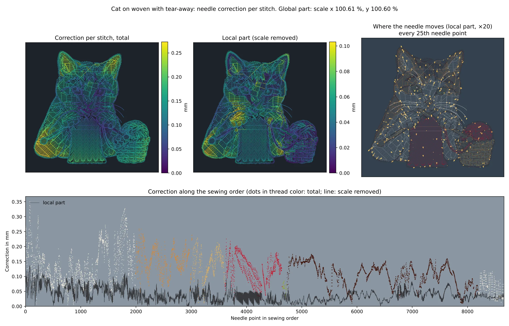
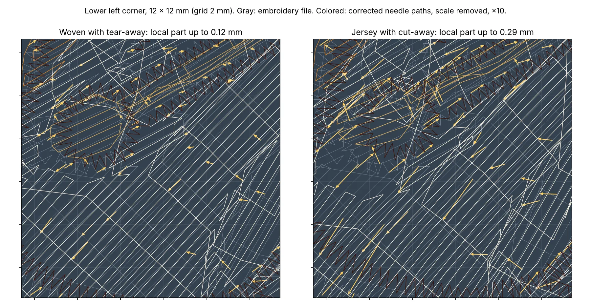

# Ausflug: Stoffverzug Stich für Stich vorausberechnen

*Ein Rechenexperiment, kein Teil der App. Stand Oktober 2026.*

*[English version](README.md). Die Beschriftungen in den Bildern sind englisch.*



*Die Katze auf Webware, Stich für Stich. Der Untergrund zeigt, wie weit sich der Stoff gerade verschoben hat (hell = mehr), das Raster ist 2 mm. Am Ende wird ausgespannt. Alle Verschiebungen sind 15-fach überhöht.*

## Die Frage

Beim Sticken zieht jeder Stich den Stoff ein wenig zusammen. Gute Sticksoftware gleicht das je Objekt aus: Der Zugausgleich macht Satinsäulen und Füllungen etwas breiter, als sie gezeichnet sind. Heatstitch macht das auch. Aber der Stoff verzieht sich nicht nur unter einem Objekt, sondern als Ganzes, und zwar in der Reihenfolge, in der gestickt wird. Ein Stich, der spät kommt, trifft auf Stoff, den alle vorherigen Stiche schon verschoben haben.

Daraus die Frage: **Kann man den Gesamtverzug eines Stickmusters vorausberechnen und jedem einzelnen Stich in der richtigen Reihenfolge eine Positionskorrektur geben? Und lohnt sich das?**

## Was es schon gibt

- **Sticksoftware:** Wilcom EmbroideryStudio und Hatch stellen den Zugausgleich je Objekt aus der Stoffwahl ein, seit Version 28 auch je Seite getrennt ([Wilcom Hilfe](https://docs.wilcom.com/embroiderystudio/28/en/OnlineHelp/Quality/stabilizing/stabilizing-16.htm), [Blog Push/Pull](https://wilcom.com/resources/blog/push-and-pull-compensation)). Ink/Stitch hat Zugausgleich nur je Objekt ([Forum](https://inkscape.org/forums/embroidery/global-parameters-for-shrink-compensation_QLAQ1)), Embrilliance einen prozentualen Endpunkt-Ausgleich für Füllungen ([Hilfe](https://embrilliance.com/Help/Platform%20Win%201165/compensation.htm)). Ein Gesamtmodell über das ganze Muster hat keines dieser Programme.
- **Forschung zur Stickerei:** Gemessen wurde der Verzug, vorausberechnet nicht. Jucienė u. a. fanden 0,7 bis 4,6 % Formabweichung in Stichrichtung auf Webware und bis 8,8 % quer zu den Maschen auf Strick (*Materials Science (Medžiagotyra)* 20(1), 2014, [doi:10.5755/j01.ms.20.1.2911](https://doi.org/10.5755/j01.ms.20.1.2911)). Kaufmann und Fumeaux messen bei gestickten Antennen, wie der Faden das Trägermaterial längs der Naht zusammendrückt (EuCAP 2015, [Adelaide](https://digital.library.adelaide.edu.au/items/ea8a3c2e-9cb1-4917-b62e-511921886231/full)).
- **Nachbarfelder:** Die Umformtechnik kennt dasselbe Problem als Rückfederung von Blechteilen. Dort ist die **Displacement-Adjustment-Methode** Standard: Werkzeug simulieren, Abweichung messen, Werkzeug um die Abweichung entgegengesetzt verschieben, wiederholen (Gan und Wagoner 2004; [Übersicht](https://journals.sagepub.com/doi/reader/10.1155/2014/131253), [Lingbeek, Numisheet 2005](https://ris.utwente.nl/ws/files/6163658/numisheet_2005_lingbeek.pdf)). Nähte in Textilien werden im Faserverbundbau als Stab- oder Federelemente in FEM-Modellen nachgebildet ([Composites A 2011](https://www.sciencedirect.com/science/article/abs/pii/S1359835X11001059)). Dass Elemente nacheinander zugeschaltet werden, kennt man aus der Simulation von Schweißnähten und 3D-Druck.

## Das Modell



1. **Stoff und Vlies** sind eine ebene, dünne, elastische Haut mit unterschiedlicher Steifigkeit längs und quer (orthotrope Membran). Sie wird als Dreiecksnetz mit 1 mm Kantenlänge über einen Stickrahmen von 100 × 100 mm gelegt, am Rand festgehalten und um 0,3 % vorgedehnt, wie beim straffen Einspannen.
2. **Stiche in Stickreihenfolge.** Die Maschine sticht in festen Rahmenkoordinaten $p$. Unter der Nadel liegt aber der Stoffpunkt $X$, der durch die bisherigen Stiche schon um $u(X)$ gewandert ist: $X = p - u(X)$, gelöst per Fixpunkt. Jeder Stich wird zwischen seinen beiden Stoffpunkten als Fadenstück eingebettet, so wie Bewehrungsstäbe in einem FEM-Modell aus Beton. Seine Ruhelänge ist 2 % kürzer als die Strecke beim Einstechen. Auf starrem Stoff zöge er also mit $T = EA \cdot 0{,}02 \approx 0{,}4\,\mathrm{N}$. Danach versteift er den Stoff, wie es eine bestickte Fläche tut. Nach je 100 Stichen wird das Gleichgewicht neu gelöst.
3. **Ausspannen.** Der Rand wird frei, die Vordehnung fällt weg, die Fäden behalten ihre Ruhelänge. Das Ergebnis wird mit der Stickdatei verglichen, nach bester Drehung und Verschiebung (ohne Maßstab, denn ein Schrumpfen ist ein echter Fehler).
4. **Korrektur je Stich** nach der Displacement-Adjustment-Methode: Nadelposition ← Nadelposition − (Endlage − Soll), dann neu rechnen. Weil das Modell linear ist, reicht eine Runde, danach liegt der Restfehler unter 0,01 mm.

**Annahmen.** Keiner dieser Werte ist gemessen; sie sind so gewählt, dass eine Füllung mit 0,4 mm Abstand auf Webware etwa 2 % einzieht.

| Größe | Webware mit Reißvlies | Jersey mit Schneidvlies |
|---|---|---|
| Membransteifigkeit längs / quer | 40 / 30 N/mm | 8 / 3 N/mm |
| Schubsteifigkeit | 4 N/mm | 1 N/mm |
| Querdehnzahl | 0,2 | 0,3 |
| Fadenzug je Stich | 0,4 N | 0,4 N |
| Vordehnung im Rahmen | 0,3 % | 0,3 % |

Fast alle Ergebnisse wachsen proportional zum Fadenzug und umgekehrt zur Stoffsteifigkeit. Doppelter Fadenzug heißt doppelter Verzug.

## Der berechnete Verzug



*Links die Stickdatei. Mitte: so liegen die Stiche nach dem Ausspannen, die Abweichung 10-fach überhöht, grau dahinter das Soll. Rechts: wie weit sich jeder Punkt des Stoffs verschoben hat.*

Das Motiv zieht sich insgesamt zusammen, am stärksten an den Rändern großer Füllungen (Ohren, Pfote links unten, Korb). In der Mitte, wo Füllungen von allen Seiten ziehen, gleicht es sich weitgehend aus.

| | Webware | Jersey |
|---|---|---|
| Stoffpunkte, die im Rahmen nach dem Einstich noch wandern, mittel / max | 0,05 / 0,21 mm | 0,10 / 0,54 mm |
| Abweichung nach dem Ausspannen, mittel / 95 % / max | 0,12 / 0,21 / 0,35 mm | 0,16 / 0,33 / 0,60 mm |

Auf Jersey sieht es ähnlich aus, nur stärker:



## Wie die Korrektur je Stich aussieht

Die Korrektur ist ein Vektor je Einstich: Um so viel und in diese Richtung muss die Nadel daneben stechen, damit der Stich nach dem Ausspannen dort liegt, wo er hingehört. 8.445 Pfeile sind unlesbar, deshalb wird die Korrektur in zwei Teile zerlegt:

- **Globaler Anteil:** die beste affine Abbildung (Maßstab, Scherung, Verschiebung) über alle Einstiche. Das ist, was man auch mit „Größe ändern“ erreicht.
- **Örtlicher Anteil:** der Rest. Nur er braucht wirklich eine Rechnung je Stich.



*Oben links: jeder Stich gefärbt nach seiner gesamten Korrektur. Oben Mitte: nur der örtliche Anteil. Oben rechts: wohin die Nadel ausweicht, jeder 25. Einstich, 20-fach überhöht. Unten: die Korrektur über die Stickreihenfolge, Punkte in Garnfarbe (gesamt), die Linie zeigt den örtlichen Anteil.*

Die Nahaufnahme zeigt, wohin die Nadel ausweicht. In den Füllungen laufen die Pfeile meist **längs der Stichrichtung**, also genau in der Richtung, in der auch der Zugausgleich wirkt. Das Modell findet diesen Effekt von selbst, ohne dass er eingestellt wurde. Auf Jersey ist der Effekt etwa doppelt so groß:



| | Webware | Jersey |
|---|---|---|
| Globaler Anteil: Maßstab x / y | 100,61 / 100,60 % | 100,77 / 100,82 % |
| Örtlicher Anteil, mittel / 95 % / max | 0,04 / 0,08 / 0,14 mm | 0,08 / 0,16 / 0,37 mm |

Die Kurve über die Stickreihenfolge zeigt: Die Korrektur wächst nicht einfach mit der Zeit. Sie hängt davon ab, wo ein Objekt liegt und was vorher schon gestickt wurde. Die ersten Füllungen am Rand des Motivs brauchen am meisten, die späten Konturen (dunkelbraun) liegen auf schon versteiftem Stoff und brauchen weniger.

## Was daraus folgt

- **Das Verfahren funktioniert.** Vorwärtsrechnung und Korrektur sind sauber formulierbar, in Python mit 1-mm-Netz dauert ein Lauf rund 30 Sekunden.
- **Der Großteil ist ein Maßstab.** Mit diesen Werten müsste man die Katze um 0,6 bis 0,8 % größer sticken. Dafür braucht es keine Rechnung je Stich.
- **Der örtliche Rest ist auf Webware kleiner als die Dateiauflösung.** Stickdateien speichern in Schritten von 0,1 mm; der örtliche Anteil liegt im Mittel bei 0,04 mm. Auf Jersey erreicht er an einzelnen Stellen die Größe des Zugausgleichs.
- **Die Unsicherheit liegt in den Stoffwerten, nicht in der Rechnung.** Mit den angenommenen Werten bleibt der Verzug unter den Messwerten aus der Literatur. Entweder ziehen die Fäden stärker, der Stoff ist weicher, oder es fehlt ein Effekt. Wie straff jemand einspannt und welche Fadenspannung die Maschine hat, weiß kein Programm. Eine Korrektur mit falschem Betrag verschiebt die Lücke nur auf die andere Seite.
- **Deshalb gehört das (noch) nicht in die App.** Sinnvoll wird es erst mit gemessenen Werten je Stoff, und dann zuerst als Warnung („hier landet die Kontur vermutlich neben der Füllung“) und als Hinweis zur Reihenfolge, erst danach als gedämpfte Korrektur beim Export.

## Grenzen des Modells

- **Kein Wellen und Kräuseln.** Die Membran wird zusammengedrückt, statt nach oben auszuweichen. Wo Stoff Falten wirft, wird der Verzug unterschätzt.
- **Kein Schub.** Fäden, die sich stapeln und Stichenden nach außen drücken, fehlen. Ebenso Reibung am Rahmen und Nachgeben über die Zeit.
- **Doppelte Korrektur.** Die Stickdatei enthält schon einen Zugausgleich. Eine echte Korrektur müsste ihn herausrechnen.
- **Linear.** Bei Verzug von mehreren Prozent, etwa auf Jersey, müsste geometrisch nichtlinear gerechnet werden.

## Was man messen müsste

Die geplante Dichte-Prüfreihe (Dichteleiter auf Webware und Frottee) stickt 25 Messkreuze im Raster von 22 mm als Erstes. Ihr Abstand nach dem Ausspannen ist schon ein gemessenes Verschiebungsfeld. Für dieses Modell fehlen drei Dinge:

1. **Doppelmarken:** Dieselben Kreuze am Ende noch einmal in einer anderen Farbe sticken. Der Versatz zwischen beiden zeigt direkt, wie weit der Stoff im Rahmen gewandert ist. Auf einem Scan mit 600 dpi sind 0,1 mm messbar.
2. **Wiederholung:** Dieselbe Datei zweimal auf demselben Stoff, jedes Mal neu eingespannt. Erst die Streuung sagt, ob eine Korrektur überhaupt helfen kann. Faustregel: Ist die Streuung kleiner als die Hälfte des Verzugs, lohnt sich ein Modell.
3. **Reihenfolge-Probe:** Ein Satinring um eine Füllung, einmal Füllung zuerst und einmal Ring zuerst. Sagt das Modell die Lücke voraus, und schließt die Korrektur sie?

## Selbst nachrechnen

Alles liegt in [scripts/](scripts/). Gebraucht werden Node (für das Einlesen der PES über Heatstitch selbst) und Python mit `numpy`, `scipy` und `matplotlib`; für das Video zusätzlich `ffmpeg`.

```sh
# im Repo-Wurzelverzeichnis
cp docs/excursions/fabric-distortion/scripts/cat-pes.vitest.ts tests/zz-cat-pes.test.ts
CAT=dump npx vitest run tests/zz-cat-pes.test.ts       # Stiche nach scripts/output/

cd docs/excursions/fabric-distortion/scripts
python3 run.py woven        # Simulation und Korrektur, Webware (run.py knit für Jersey)
python3 plot.py woven       # Verzug- und Korrekturbild
python3 detail.py           # Nahaufnahme (braucht woven und knit)
python3 video.py woven 15   # Ablauf als Video, 15-fach überhöht

cd ../../../..
CAT=write npx vitest run tests/zz-cat-pes.test.ts      # korrigierte Katzen als PES
rm tests/zz-cat-pes.test.ts
```

| Datei | Inhalt |
|---|---|
| [sim.py](scripts/sim.py) | Netz, Membran, eingebettete Fäden, Lauf in Stickreihenfolge, Ausspannen |
| [run.py](scripts/run.py) | ein Lauf ohne Korrektur, dann Displacement Adjustment |
| [plot.py](scripts/plot.py), [detail.py](scripts/detail.py), [video.py](scripts/video.py) | Bilder und Video |
| [cat-pes.vitest.ts](scripts/cat-pes.vitest.ts) | liest die Katze mit Heatstitch ein und schreibt die korrigierten PES |

Die korrigierten PES lassen sich in Heatstitch öffnen und mit dem Original vergleichen. Zum Sticken sind sie nicht gedacht, solange die Stoffwerte nicht gemessen sind.
