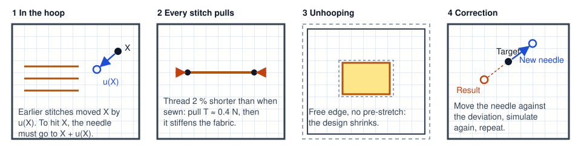

# Excursion: predicting fabric distortion stitch by stitch

*A numerical experiment, not part of the app. October 2026.*

*[Deutsche Fassung](README.de.md)*


*The cat on woven fabric, stitch by stitch. The background shows how far the fabric has moved at that moment (brighter = more); the grid is 2 mm. At the end the hoop is released. All displacements are exaggerated 15 times.*

## The question

Every stitch pulls the fabric in a little. Good embroidery software compensates for this per object: pull compensation makes satin columns and fills slightly wider than drawn. Heatstitch does that too. But the fabric does not only distort under one object, it distorts as a whole, and in the order the design is sewn. A stitch that comes late lands on fabric that all earlier stitches have already moved.

Hence the question: **Can the total distortion of an embroidery design be predicted, and can every single stitch get a position correction in the right order? And is it worth it?**

## Prior art

- **Embroidery software:** Wilcom EmbroideryStudio and Hatch set pull compensation per object from the chosen fabric, and since version 28 separately per side ([Wilcom help](https://docs.wilcom.com/embroiderystudio/28/en/OnlineHelp/Quality/stabilizing/stabilizing-16.htm), [blog on push and pull](https://wilcom.com/resources/blog/push-and-pull-compensation)). Ink/Stitch has pull compensation per object only ([forum](https://inkscape.org/forums/embroidery/global-parameters-for-shrink-compensation_QLAQ1)), Embrilliance a percentage end point compensation for fills ([help](https://embrilliance.com/Help/Platform%20Win%201165/compensation.htm)). None of these programs has a model of the whole design.
- **Research on embroidery:** the distortion has been measured, not predicted. Jucienė et al. found shape deviations of 0.7 to 4.6 % in stitch direction on woven fabric and up to 8.8 % across the wales of knits (*Materials Science (Medžiagotyra)* 20(1), 2014, [doi:10.5755/j01.ms.20.1.2911](https://doi.org/10.5755/j01.ms.20.1.2911)). Kaufmann and Fumeaux measured how the thread compresses the substrate along the seams of embroidered antennas (EuCAP 2015, [Adelaide](https://digital.library.adelaide.edu.au/items/ea8a3c2e-9cb1-4917-b62e-511921886231/full)).
- **Neighboring fields:** sheet metal forming knows the same problem as springback. There the **displacement adjustment method** is standard: simulate the tool, measure the deviation, move the tool against the deviation, repeat (Gan and Wagoner 2004; [overview](https://journals.sagepub.com/doi/reader/10.1155/2014/131253), [Lingbeek, Numisheet 2005](https://ris.utwente.nl/ws/files/6163658/numisheet_2005_lingbeek.pdf)). Composite manufacturing models seams in textiles as bar or spring elements in FE models ([Composites A 2011](https://www.sciencedirect.com/science/article/abs/pii/S1359835X11001059)). Adding elements one after another is common in the simulation of welds and 3D printing.

## The model



1. **Fabric and stabilizer** are a flat, thin, elastic sheet with different stiffness along and across (an orthotropic membrane). It is meshed with triangles of 1 mm over a 100 × 100 mm hoop, held at the edge and pre-stretched by 0.3 %, as with tight hooping.
2. **Stitches in sewing order.** The machine sews in fixed hoop coordinates $p$. Under the needle, however, lies the fabric point $X$ that earlier stitches have already moved by $u(X)$: $X = p - u(X)$, solved by fixed-point iteration. Every stitch is embedded between its two fabric points as a piece of thread, like rebar in a finite element model of concrete. Its rest length is 2 % shorter than the distance when it was sewn, so on rigid fabric it would pull with $T = EA \cdot 0.02 \approx 0.4\,\mathrm{N}$. After that it stiffens the fabric, as an embroidered area does. Equilibrium is solved again after every 100 stitches.
3. **Unhooping.** The edge becomes free, the pre-stretch goes away, the threads keep their rest lengths. The result is compared with the embroidery file after the best rotation and translation (but no scaling, because shrinking is a real error).
4. **Correction per stitch** with the displacement adjustment method: needle position ← needle position − (final position − target), then simulate again. Since the model is linear, one round is enough; after it the remaining error is below 0.01 mm.

**Assumptions.** None of these values is measured; they are chosen so that a fill with 0.4 mm spacing on woven fabric pulls in by about 2 %.

| Quantity | Woven with tear-away | Jersey with cut-away |
|---|---|---|
| Membrane stiffness along / across | 40 / 30 N/mm | 8 / 3 N/mm |
| Shear stiffness | 4 N/mm | 1 N/mm |
| Poisson's ratio | 0.2 | 0.3 |
| Thread pull per stitch | 0.4 N | 0.4 N |
| Pre-stretch in the hoop | 0.3 % | 0.3 % |

Almost all results grow in proportion to the thread pull and in inverse proportion to the fabric stiffness. Twice the thread pull means twice the distortion.

## The computed distortion


*Left: the embroidery file. Middle: where the stitches lie after unhooping, the deviation exaggerated 10 times, with the target in gray behind. Right: how far every point of the fabric has moved.*

The design shrinks as a whole, most at the edges of large fills (ears, lower left paw, basket). In the middle, where fills pull from all sides, it largely evens out.

| | Woven | Jersey |
|---|---|---|
| Fabric points that still move in the hoop after they were sewn, mean / max | 0.05 / 0.21 mm | 0.10 / 0.54 mm |
| Deviation after unhooping, mean / 95 % / max | 0.12 / 0.21 / 0.35 mm | 0.16 / 0.33 / 0.60 mm |

On jersey it looks similar, only stronger:


## What the correction per stitch looks like

The correction is one vector per needle point: by this much and in this direction the needle has to go elsewhere, so that the stitch ends up where it belongs after unhooping. 8,445 arrows are unreadable, so the correction is split into two parts:

- **Global part:** the best affine map (scale, shear, translation) over all needle points. This is what resizing the design also achieves.
- **Local part:** the rest. Only this part really needs a computation per stitch.


*Top left: every stitch colored by its total correction. Top middle: the local part only. Top right: where the needle moves, every 25th needle point, exaggerated 20 times. Bottom: the correction along the sewing order, dots in thread color (total); the line shows the local part.*

The close-up shows where the needle moves. In the fills the arrows mostly run **along the stitch direction**, which is exactly the direction in which pull compensation acts. The model finds this effect by itself, without it being set anywhere. On jersey the effect is about twice as large:


| | Woven | Jersey |
|---|---|---|
| Global part: scale x / y | 100.61 / 100.60 % | 100.77 / 100.82 % |
| Local part, mean / 95 % / max | 0.04 / 0.08 / 0.14 mm | 0.08 / 0.16 / 0.37 mm |

The curve along the sewing order shows that the correction does not simply grow with time. It depends on where an object lies and what was sewn before. The first fills at the edge of the design need the most; the late outlines (dark brown) lie on fabric that is already stiffened and need less.

## What follows

- **The method works.** Forward simulation and correction can be formulated cleanly; in Python with a 1 mm mesh one run takes about 30 seconds.
- **Most of it is a scale.** With these values the cat would have to be sewn 0.6 to 0.8 % larger. That needs no computation per stitch.
- **On woven fabric the local part is smaller than the file resolution.** Embroidery files store positions in steps of 0.1 mm; the local part is 0.04 mm on average. On jersey it reaches the size of pull compensation in some places.
- **The uncertainty lies in the material values, not in the computation.** With the assumed values the distortion stays below the measurements from the literature. Either the threads pull harder, the fabric is softer, or an effect is missing. How tightly someone hoops and what thread tension the machine has, no program knows. A correction of the wrong size only moves the gap to the other side.
- **That is why this does not belong in the app (yet).** It becomes useful only with measured values per fabric, and then first as a warning ("the outline will probably land next to the fill here") and as a hint on sewing order, and only after that as a damped correction on export.

## Limits of the model

- **No puckering.** The membrane is compressed instead of buckling upward. Where fabric puckers, the distortion is underestimated.
- **No push.** Threads that stack up and push stitch ends outward are missing, as are friction at the hoop and creep over time.
- **Double compensation.** The embroidery file already contains pull compensation. A real correction would have to take it out first.
- **Linear.** With distortion of several percent, as on jersey, a geometrically nonlinear computation would be needed.

## What would have to be measured

The planned density test series (a density ladder on woven fabric and terry) sews 25 measuring crosses on a 22 mm grid first. Their spacing after unhooping is already a measured displacement field. For this model three things are missing:

1. **Double marks:** sew the same crosses again at the end in another color. The offset between the two shows directly how far the fabric moved in the hoop. On a 600 dpi scan, 0.1 mm can be measured.
2. **Repetition:** the same file twice on the same fabric, hooped anew each time. Only the scatter tells whether a correction can help at all. Rule of thumb: if the scatter is less than half of the distortion, a model is worth it.
3. **Sequence test:** a satin ring around a fill, once fill first and once ring first. Does the model predict the gap, and does the correction close it?

## Run it yourself

Everything is in [scripts/](scripts/). You need Node (Heatstitch itself reads the PES) and Python with `numpy`, `scipy` and `matplotlib`; for the video also `ffmpeg`.

```sh
# in the repository root
cp docs/excursions/fabric-distortion/scripts/cat-pes.vitest.ts tests/zz-cat-pes.test.ts
CAT=dump npx vitest run tests/zz-cat-pes.test.ts       # stitches to scripts/output/

cd docs/excursions/fabric-distortion/scripts
python3 run.py woven        # simulation and correction, woven (run.py knit for jersey)
python3 plot.py woven       # distortion and correction figures
python3 detail.py           # close-up (needs woven and knit)
python3 video.py woven 15   # sewing as a video, exaggerated 15 times

cd ../../../..
CAT=write npx vitest run tests/zz-cat-pes.test.ts      # corrected cats as PES
rm tests/zz-cat-pes.test.ts
```

| File | Content |
|---|---|
| [sim.py](scripts/sim.py) | mesh, membrane, embedded threads, run in sewing order, unhooping |
| [run.py](scripts/run.py) | one run without correction, then displacement adjustment |
| [plot.py](scripts/plot.py), [detail.py](scripts/detail.py), [video.py](scripts/video.py) | figures and video |
| [cat-pes.vitest.ts](scripts/cat-pes.vitest.ts) | reads the cat with Heatstitch and writes the corrected PES |

The corrected PES files can be opened in Heatstitch and compared with the original. They are not meant for sewing as long as the material values are not measured.
